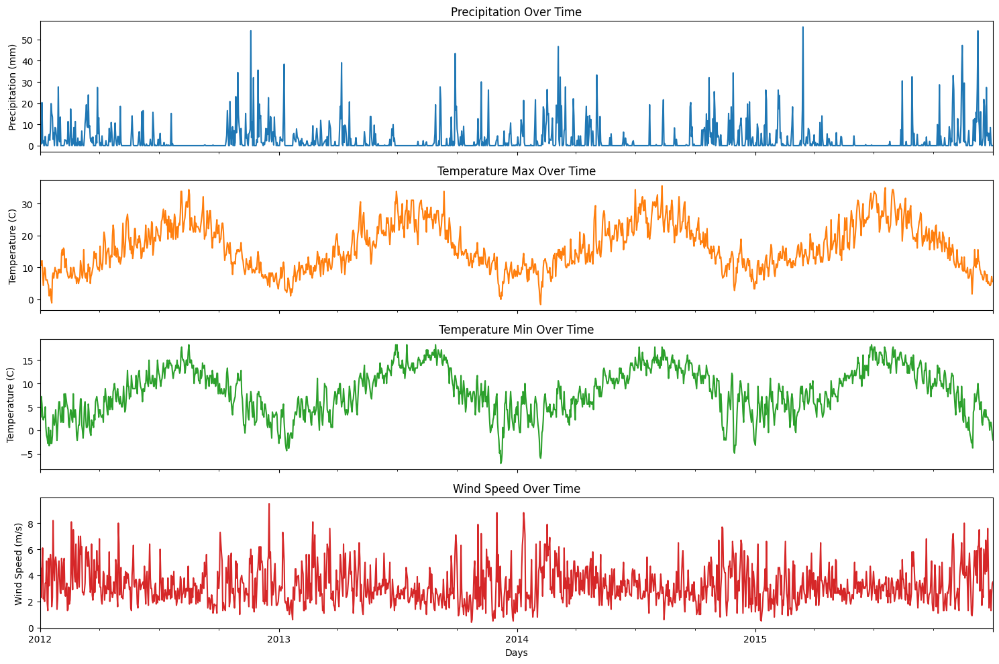
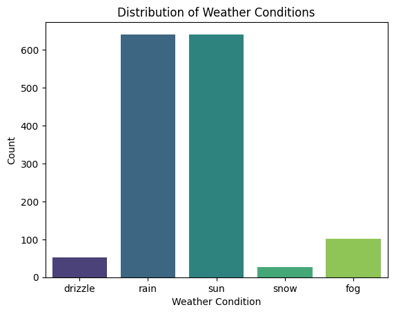

# Seattle Weather Classification Concept

Up until very recently, people relied solely on media such as newspapers and television to get information about weather forecasts. Now that weather forecasts are delivered primarily on cellphone apps and are predicted mostly with computer programs, forecast data needs to be translated into something easily understandable for people. There are many ways to algorithmically classify weather like this, but one interesting method is to train a simple supervised machine-learning model on historical weather conditions. To do so one would need a large collection of weather data. 

The dataset that was used to train the first iteration of this model was historical weather data for Seattle from the years 2012 to 2015. This data included features like the date, precipitation, temperature, and wind speed, as well as target labels like “rain,” “sun,” “snow,” etc. In order to make the data more informative, certain features were engineered to provide insight into seasonal patterns or weather-science. After that, many models were trained to predict labels and evaluated on testing data.

The best model for this task turned out to be a Random Forest Classifier, which produced a weighted F1 score of about 0.77. This classifier was successfully able to label common weather patterns as well as some uncommon patterns, however it was finally evident that there were likely some problems with the data set causing most models to be somewhat inefficient. Target labels were unbalanced, and certain ones may not have been very useful as they were extremely uncommon. Also, certain labels were absent from the data such as “cloudy,” and “partly cloudy,” which would have been useful for a practical model. Also, certain features were absent such as air pressure and humidity. 

The final conclusion of the results of this project was that different data would be better for this task, or possibly that a different task would be more suited to this data. For example, clustering would have been useful on this data set to get an idea of similar weather patterns, regardless of target labels. 
